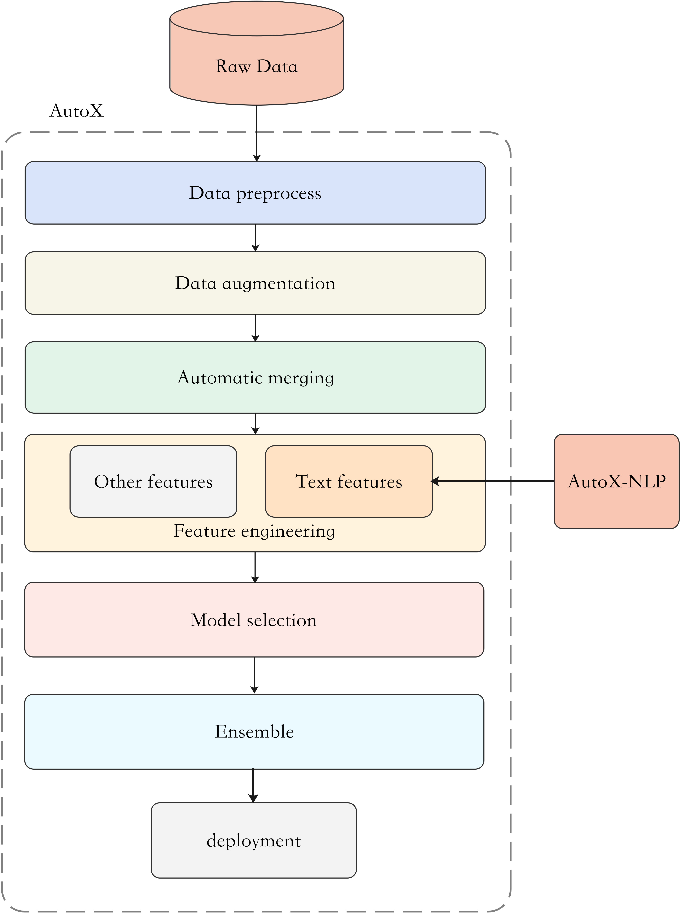

[English](./README_EN.md) | 简体中文

# autox_nlp是什么
AutoX_nlp 是针对文本数据进行处理的辅助工具。
它的特点包括：
- 效果出色：基于该工具与AutoX通用自动化建模的解决方案，在多个kaggle数据集上，效果显著优于其他解决方案(见[效果对比](#效果对比))。
- 高效处理：该工具在不同字符长度的文本数据处理上，速度显著优于其他AutoML的文本处理工具(见[处理效率对比](#处理效率对比))。
- 多方式提取：该工具支持TFIDF、Word2Vec、Glove、FastText、Bert 和 Zero-shot labeling 六种特征提取方式。
- 多样化特征：支持直接输出Embedding特征，也支持输出离散型、连续型特征。

<div align="center"></div>

# 目录
<!-- TOC -->

- [安装](#安装)
- [比赛案例](#比赛案例)
- [快速上手](#快速上手)
- [效果对比](#效果对比)
- [处理效率对比](#处理效率对比)
- [如何给AutoX_nlp做贡献](#如何给AutoX_nlp做贡献)

<!-- /TOC -->
# 安装

### github仓库安装
```
git clone https://github.com/4paradigm/autox.git
## github访问速度较慢时可以通过gitee地址 https://gitee.com/poteman/autox
pip install ./autox
```

### pip安装
```
## pip安装包可能更新不及时，建议用github安装方式安装最新版本
!pip install automl-x -i https://www.pypi.org/simple/
```
# 比赛案例
见[效果对比](#效果对比)和[处理效率对比](#处理效率对比)。
点击表格中的超链接可跳转至kaggle平台的线上demo，无需配置环境直接运行

# 快速上手
- [文本特征提取](feature_engineer/README.md)

# 如何给AutoX_nlp做贡献
[如何给AutoX_nlp做贡献](./call_for_contribute.md)


# 效果对比
| Task type      | Dataset name                                                                             | Evaluation Metric | AutoX                                                                       | AutoGluon                                                                     | H2o                                                                           |
|----------------|------------------------------------------------------------------------------------------|-------------------|-----------------------------------------------------------------------------|-------------------------------------------------------------------------------|-------------------------------------------------------------------------------|
| Regression     | [CommonlitReadability](https://www.kaggle.com/hengwdai/commonlit-readability-data-split) | RMSE              | [0.597](https://www.kaggle.com/code/hengwdai/commonlit-readability-auto3ml) | [1.022](https://www.kaggle.com/code/hengwdai/commonlit-readability-autogluon) | [1.023](https://www.kaggle.com/code/hengwdai/commonlit-readability-h2o)       |
| Regression     | [Amazonbookprice](https://www.kaggle.com/hengwdai/amazon-book-price-data-split)          | RMSE              | [629.792](https://www.kaggle.com/code/hengwdai/amazon-book-price-auto3ml)   | [687.870](https://www.kaggle.com/hengwdai/amazon-book-price-autogluon)        | [642.167](https://www.kaggle.com/code/hengwdai/amazon-book-price-h2o/)        |
| Regression     | [MercariPrice](https://www.kaggle.com/hengwdai/mercariprice-data-split)                  | RMSE              | [32.042](https://www.kaggle.com/code/hengwdai/mercariprice-auto3ml)         | [34.500](https://www.kaggle.com/code/hengwdai/mercariprice-autogluon)         | [43.960](https://www.kaggle.com/code/hengwdai/mercariprice-h2o)               |
| Classification | [Titanic](https://www.kaggle.com/competitions/titanic/data)                              | AUC               | [0.794](https://www.kaggle.com/code/hengwdai/autox-titanic)                 | [0.780](https://www.kaggle.com/code/sishihara/autogluon-tabular-for-titanic)  | [0.768](https://www.kaggle.com/code/hengwdai/titanic-solution-with-basic-h2o) |
| Classification | [Stumbleupon](https://www.kaggle.com/hengwdai/stumbleupon-data-split)                    | AUC               | [0.855](https://www.kaggle.com/code/hengwdai/stumbleupon-auto3ml)           | [0.503](https://www.kaggle.com/code/hengwdai/stumbleupon-autogluon)           | [0.707](https://www.kaggle.com/code/hengwdai/stumbleupon-h2o)                 |
| Classification | [DisasterTweets](https://www.kaggle.com/competitions/nlp-getting-started/data)           | AUC               | [0.786](https://www.kaggle.com/code/hengwdai/tweeter-autox)                 | [0.746](https://www.kaggle.com/hengwdai/tweeter-autogluon)                    | [0.721](https://www.kaggle.com/code/hengwdai/tweeter-h2o)                     |

# 处理效率对比
使用文本处理工具，将数据集中特定文本列 (不同文本列的平均字符数不同) 转化为数值特征，统计整个流程所用时间并除以文本条数，得到处理效率 (TPS)。<br>
注：不同工具处理方式不同，具体流程可以点击表格中的超链接访问对应demo查看。

| Dataset              | Text Column     | Average Text Length | TPS    | AutoX                                                                               | AutoGluon                                                                               | H2O                                                                                    |
|----------------------|-----------------|---------------------|--------|-------------------------------------------------------------------------------------|-----------------------------------------------------------------------------------------|----------------------------------------------------------------------------------------|
| MercariPrice         | BrandName       | 6                   | item/s | [3480.66](https://www.kaggle.com/hengwdai/mercariprice-6-efficiency-auto3ml)        | [127.15](https://www.kaggle.com/hengwdai/mercariprice-6-efficiency-autogluon)           | [979.18](https://www.kaggle.com/hengwdai/mercariprice-6-efficiency-h2o)                |
| MercariPrice         | CategoryName    | 30                  | item/s | [2215.40](https://www.kaggle.com/hengwdai/mercariprice-30-efficiency-auto3ml)       | [118.92](https://www.kaggle.com/hengwdai/mercariprice-30-efficiency-autogluon)          | [656.80](https://www.kaggle.com/code/hengwdai/mercariprice-30-efficiency-h2o)          |
| MercariPrice         | ItemDescription | 150                 | item/s | [466.73](https://www.kaggle.com/hengwdai/mercariprice-150-efficiency-auto3ml)       | [65.46](https://www.kaggle.com/hengwdai/mercariprice-150-efficiency-autogluon)          | [183.14](https://www.kaggle.com/hengwdai/mercariprice-150-efficiency-h2o)              |
| TMDBBoxOffice        | Overview        | 300                 | item/s | [282.73](https://www.kaggle.com/code/hengwdai/tmdbboxoffice-300-efficiency-auto3ml) | [20.74](https://www.kaggle.com/code/hengwdai/tmdbboxoffice-300-efficiency-autogluon)    | [79.18](https://www.kaggle.com/hengwdai/tmdbboxoffice-300-efficiency-h2o)              |
| CommonlitReadability | Excerpt         | 1000                | item/s | [103.99](https://www.kaggle.com/hengwdai/commonlitreadability-1000-efficiency)      | [12.39](https://www.kaggle.com/hengwdai/commonlitreadability-1000-efficiency-autogluon) | [30.30](https://www.kaggle.com/code/hengwdai/commonlitreadability-1000-efficiency-h2o) |
