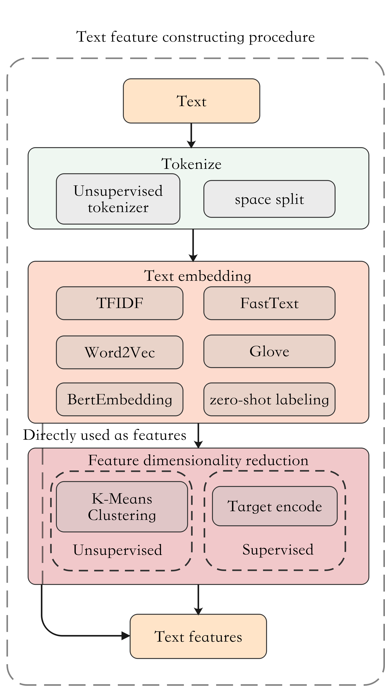

[English](./README_EN.md) | 简体中文

# autox_nlp.feature_engineer是什么
feature_engineer 是autox_nlp的特征工程模块。

<div align="center"></div> 

# 目录
<!-- TOC -->
- [调用方式](#调用方式)
- [按分词方式划分](#按分词方式划分)
- [按特征提取方式划分](#按特征提取方式划分)
- [按特征输出形式划分](#按特征输出形式划分)
- [class NLP_feature](#NLP_feature)

<!-- /TOC -->
# 调用方式

```
from autox.autox_nlp import NLP_feature
import pandas as pd

nlp = NLP_feature()

train = pd.read_csv('train.csv')
test  = pd.read_csv('test.csv')

# Use fit to get meta_feature
train_meta_feature = nlp.fit_transform(train, ['text_column_name'], use_Toknizer, embedding_mode, task, y, candidate_labels)
test_meta_feature = nlp.transform(test)

# Concat meta feature with raw data
for column in train_meta_feature.columns:
    train[column] = train_meta_feature[column]
    test[column] = test_meta_feature[column]

train.to_csv('new_train.csv')
test.to_csv('new_test.csv')
```

# 快速上手
[使用demo：CommmonLit Readability prize](https://www.kaggle.com/hengwdai/quickstart-auto3ml-nlp)
## 按分词方式划分
### 空格分词
```
use_Toknizer=False

train_meta_feature = nlp.fit_transform(df_train,['text_column_name'],use_Toknizer,'Word2Vec','unsupervise')
test_meta_feature = nlp.transform(test)

# Concat meta feature with raw data
for column in train_meta_feature.columns:
    train[column] = train_meta_feature[column]
    test[column] = test_meta_feature[column]

train.to_csv('new_train.csv')
test.to_csv('new_test.csv')
```
### 无监督分词器分词
```
use_Toknizer=True

train_meta_feature = nlp.fit_transform(df_train,['text_column_name'],use_Toknizer,'Word2Vec','unsupervise')
test_meta_feature = nlp.transform(test)

# Concat meta feature with raw data
for column in train_meta_feature.columns:
    train[column] = train_meta_feature[column]
    test[column] = test_meta_feature[column]

train.to_csv('new_train.csv')
test.to_csv('new_test.csv')
```
## 按特征提取方式划分
### TFIDF
```
emb_mode='TFIDF'

train_meta_feature = nlp.fit_transform(df_train,['text_column_name'],True,emb_mode,'unsupervise')
test_meta_feature = nlp.transform(test)

# Concat meta feature with raw data
for column in train_meta_feature.columns:
    train[column] = train_meta_feature[column]
    test[column] = test_meta_feature[column]

train.to_csv('new_train.csv')
test.to_csv('new_test.csv')
```
### Word2Vec
```
emb_mode='Word2Vec'

train_meta_feature = nlp.fit_transform(df_train,['text_column_name'],True,emb_mode,'unsupervise')
test_meta_feature = nlp.transform(test)

# Concat meta feature with raw data
for column in train_meta_feature.columns:
    train[column] = train_meta_feature[column]
    test[column] = test_meta_feature[column]

train.to_csv('new_train.csv')
test.to_csv('new_test.csv')
```
### FastText
```
emb_mode='FastText'

train_meta_feature = nlp.fit_transform(df_train,['text_column_name'],True,emb_mode,'unsupervise')
test_meta_feature = nlp.transform(test)

# Concat meta feature with raw data
for column in train_meta_feature.columns:
    train[column] = train_meta_feature[column]
    test[column] = test_meta_feature[column]

train.to_csv('new_train.csv')
test.to_csv('new_test.csv')
```
### Glove
```
emb_mode='Glove'

train_meta_feature = nlp.fit_transform(df_train,['text_column_name'],True,emb_mode,'unsupervise')
test_meta_feature = nlp.transform(test)

# Concat meta feature with raw data
for column in train_meta_feature.columns:
    train[column] = train_meta_feature[column]
    test[column] = test_meta_feature[column]

train.to_csv('new_train.csv')
test.to_csv('new_test.csv')
```
### Bert
```
emb_mode='Bert'

train_meta_feature = nlp.fit_transform(df_train,['text_column_name'],True,emb_mode,'unsupervise')
test_meta_feature = nlp.transform(test)

# Concat meta feature with raw data
for column in train_meta_feature.columns:
    train[column] = train_meta_feature[column]
    test[column] = test_meta_feature[column]

train.to_csv('new_train.csv')
test.to_csv('new_test.csv')
```
### Zero-shot Labeling
```
task='zero-shot-classification'
hypothesis = {'text_column_name':[
                        'this text is too complex',
                        'this text is easy to understand'
                        ]}

train_meta_feature = nlp.fit_transform(
              df = train,
              text_columns_def = ['text_column_name'],
              use_tokenizer = True,
              text_columns_def = None,
              task = task, 
              y = None,
              text_columns_def = hypothesis )

train_meta_feature = nlp.transform(train)
test_meta_feature = nlp.transform(test)
```
## 按特征输出形式划分
### 直接输出embedding
```
task='embedding'

train_sparse_matrix = nlp.fit_transform(df_train,['text_column_name'],True,'Word2Vec',task)

test_sparse_matrix = nlp.transform(test)
```
### 使用target encode输出数值型特征
```
task='supervise'

train_meta_feature = nlp.fit_transform(df_train,['text_column_name'],True,'Word2Vec',task)
test_meta_feature = nlp.transform(test)

# Concat meta feature with raw data
for column in train_meta_feature.columns:
    train[column] = train_meta_feature[column]
    test[column] = test_meta_feature[column]

train.to_csv('new_train.csv')
test.to_csv('new_test.csv')
```
### 使用k means输出离散型特征
```
task='unsupervise'

train_meta_feature = nlp.fit_transform(df_train,['text_column_name'],True,'Word2Vec',task)
test_meta_feature = nlp.transform(test)

# Concat meta feature with raw data
for column in train_meta_feature.columns:
    train[column] = train_meta_feature[column]
    test[column] = test_meta_feature[column]

train.to_csv('new_train.csv')
test.to_csv('new_test.csv')
```

# NLP_feature

文本特征提取工具，以分词、词嵌入（特征提取）、特征降维的流程对文本进行处理。
## 属性介绍
```
· text_columns_def (list)       - 数据集里面的文本列列名
· task (str)                    - 特征降维的方法 ('embedding'/'supervise'/'unsupervise'/'zero-shot-classification')
· y (DataFrame)                 - 数据集里面的目标值列
· use_tokenizer (bool)          - 是否使用无监督分词器
· embedding_mode (str)          - 词嵌入(特征提取)方式 ('TFIDF'/'Word2Vec'/'Glove'/'FastText'/'Bert')
· candidate_labels (dict)       - 若使用zero-shot labeling，则需要为每个文本列设置可能的类别，存储于字典中
· tokenizers (dict)             - 以字典形式存储的分词器，key为文本列列名，value为对应分词器
· embeddings (dict)             - 以字典形式存储的词嵌入模型，key为文本列列名，value为对应模型
· encoders (dict)               - 以字典形式存储的特征降维模型，key为文本列列名，value为对应模型
· model_name (str)              - 使用Bert进行词嵌入时所用的预训练模型，可以使用huggingface上其他的模型
· zero_shot_model (str)         - 使用zero-shot进行特征提取时所用的预训练模型，可以使用huggingface上其他的模型
· corpus_model (dict)           - 以字典形式存储的Glove前置模型，key为文本列列名，value为对应模型
· device (str)                  - 当前所有使用深度模型场景的推理环境，若支持GPU则自动设置为cuda
· pipline (huggingface pipline) - 使用zero-shot进行特征提取时的pipeline
· n_clusters (int)              - 使用k-means进行特征降维的输出维度
· do_mlm (bool)                 - 使用Bert进行词嵌入时，是否使用mask language方式进行预训练
· mlm_epochs (int)              - 使用Bert进行词嵌入时，使用mlm预训练的训练轮次
· emb_size (int)                - 使用Word2Vec、FastText、Glove进行词嵌入时的输出维度
```
## NLP_feature.fit_transform
使用训练数据中的文本列训练特征提取pipeline，并输出提取后的训练数据文本特征
### 参数介绍
```
· df (pandas.DataFrame)                                 - 包含文本列的训练数据集
· text_columns_def (list)                               - 通过列表存储的文本列名,e.g.,['text1','text2']
· use_tokenizer (bool, optional, defaults to True)      - 是否使用无监督分词器(True,False)
· embedding_mode (str, optional, defaults to 'TFIDF')   - 词嵌入方式('TFIDF'/'Word2Vec'/'Glove'/'FastText'/'Bert')
· task (str, optional, defaults to 'unsupervise')       - 特征降维方式('embedding'/'supervise'/'unsupervise'/'zero-shot-classification')
· y (pandas.DataFrame, optional, defaults to None)      - 数据集中的目标值列,e.g., df['target']
· candidate_labels (dict, optional, defaults to None)   - 若使用zero shot，则需要为每一列文本列指定可能的类别标签,e.g.,{'text1':['label1','label2'],'text2':['label3','label2']}
```
### 返回值: pandas.DataFrame / dict { text_name : sparse.csr_matrix }
若降维方式选择embedding，则返回值格式为由文本列名和sparse.csr_matrix组成的字典, 其他方式则是由每一列文本列的特征拼接而成的DataFrame

## NLP_feature.transform
使用 fit 完成的工具类对新的测试数据进行特征提取。并输出提取后的测试数据文本特征
### 参数介绍
```
· test_df (pandas.DataFrame)                                 - 包含文本列的测试数据集，且 fit入参 'text_columns_def'指定的列必须包含在测试数据中
```
### 返回值：pandas.DataFrame / dict { text_name : sparse.csr_matrix }
由输入的测试集与每列文本列转化成的特征列拼接得到的新数据集
    
    