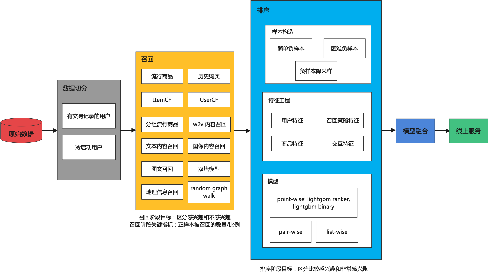

[English](./README_EN.md) | 简体中文

# <span id="autox_recommend是什么"> AutoX Recommend </span>

AutoX Recommend是一个**自动化推荐算法开源库**，

- 提供多场景的**端到端的解决方案**：根据业务数据，**自动挖掘**不同场景下的用户和物品的关联关系，提供相应场景下的推荐结果
- 支持自定义专属算法：提供召回、特征工程、排序等各模块独立接口，供进阶用户调用和组合

**应用场景：**

- 电商平台：根据用户的历史购买行为，推荐用户最可能购买的商品（猜你喜欢，经常一起购买，流行商品）
- 资讯内容：分析不同用户的偏好，理解不同模态的资讯内容，根据用户点赞转发等多种行为，进行个性化资讯推荐


# 快速上手

# 目录
<!-- TOC -->

- [AutoX Recommend是什么](#autox_recommend是什么)
- [快速上手](#快速上手)
- [目录](#目录)
- [如何给AutoX Recommend做贡献](#how-to-contribute)
- [数据集](#数据集)
- [框架](#框架)
- [效果对比](#效果对比)

<!-- /TOC -->

# <span id="how-to-contribute">如何给AutoX Recommend做贡献</span>
[如何给AutoX Recommend做贡献](./call_for_contribute.md)

# 数据集
[数据集链接](./datasets/README.md)

# 框架


## 数据切分
- 有交易记录的用户: 采用多路召回+排序+模型融合的方式进行推荐
- 冷启动用户(没有交易记录的用户): 采用流行商品召回的方式进行推荐

## 召回
召回阶段需要重点关注正样本被召回的数量以及比例

- 流行项目召回
```
最近一段时间内购买频次最多的商品
```

- 历史购买召回
```
将用户历史购买过的商品再次推荐给用户
```

- ItemCF召回
```
itemcf相似性的计算会有很多变种,比如考虑时间权重.
```
- Swing召回
```
itemcf的变形,计算相似性的时候考虑两个用户重合度的大小.
参考[02_Retrieval_02](https://github.com/wangshusen/RecommenderSystem/blob/main/Slides/02_Retrieval_02.pdf)
```

- UserCF召回

- 分组流行商品召回
```
将商品按照某种类别进行分组，统计每组内的流行商品；
遍历用户历史购买记录的商品，将商品所属类别的流行商品推荐给用户。
```

- w2v内容召回
```
将所用用户的商品购买记录数据，传入Word2Vec模型，获得每个商品的表达向量；
利用商品的表达向量计算商品之间的相似性；
遍历用户历史购买记录的商品，将和该商品相似性较高的其他商品推荐给用户。
```

- NLP内容召回
```
和w2v内容召回类似，区别在于相似性的计算，
利用商品对应文本描述的embedding向量来计算商品相似性。
```

- 图像内容召回
```
和w2v内容召回类似，区别在于相似性的计算，
利用商品对应图像提取出的embedding向量来计算商品相似性。
```

- random graph walk召回
```
待补充
```

## 排序

### 样本构造
```
1. 被召回且在交易记录中，作为正样本, 召回而没有在交易记录中, 作为负样本;
2. 负样本降采样.
```

### 特征工程
- 用户特征
```
1. 对自带的用户信息表进行预处理(如label_encode)后作为特征;
2. 将交易表对用户进行聚合提取统计特征。 例如用户订单平均价格。
可以取不同时间范围内的交易记录，以及不同的op,
连续型变量的op包括min, max, mean, std, median, sum, count,
离散型变量的op包括nunique.
```
- 商品特征
```
1. 对自带的商品信息表进行预处理(如label_encode)后作为特征;
2. 将交易表对商品进行聚合提取统计特征。 例如商品的平均价格。
可以取不同时间范围内的交易记录，以及不同的op,
连续型变量的op包括min, max, mean, std, median, sum, count,
离散型变量的op包括nunique.
```

- 交互特征
```
1. user-item 组合在不同时间窗口(1天、3天、一周、一个月等)内的count;
2. 用户上次购买该商品距离当前的时间差;
```

- 召回策略特征
```
1. 历史购买召回对应的历史购买次数;
2. itemcf召回的score
3. 流行度召回的count数
4. 内容召回的相似性score
```

### 模型
- lightgbm ranker(对于每一个用户, 对其候选的商品集进行排序)
- lightgbm binary
- xgboost binary
- catboost binary

## 模型融合
用不同的数据周期+召回+特征+排序模型组合可以获得不同的结果。
对于一个用户来说，每个方法都会推荐给用户多个带排序的商品，
基于排序的权重来对结果进行融合。
[参考](https://www.kaggle.com/code/tarique7/lb-0-0240-h-m-ensemble-magic-multi-blend)

## 效率优化
```
1. 召回结果和特征结果的存档
2. Inference阶段, 将所有用户拆成多个批次, 并行计算
3. reduce_mem_usage函数
```

# 效果对比
