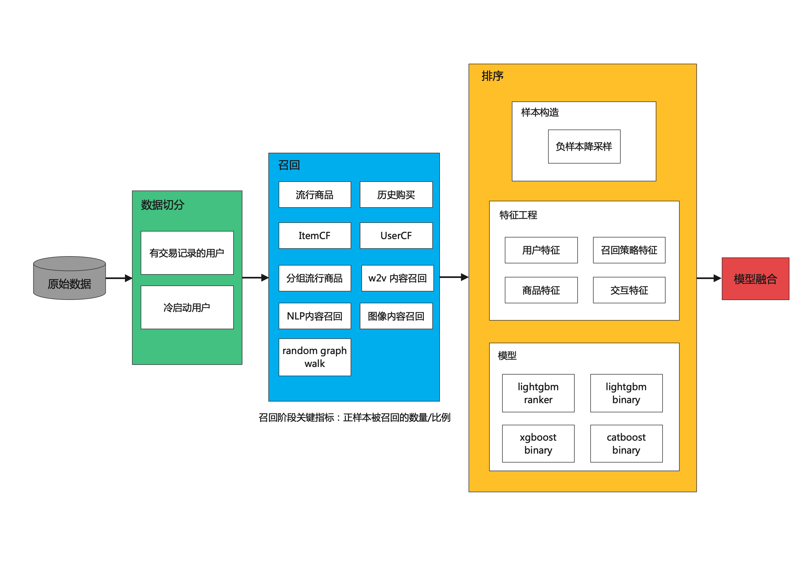

# AutoX Recommend System

## 联系方式

- AutoX贡献者意向成员群
  
- Email: caihengxing@4paradigm.com

## 1. 数据集收集和处理
|数据 | 数据处理 |
|------------ | ------------- |
|[MovieLens](https://grouplens.org/datasets/movielens/25m/) | [MovieLens_data_process](./data_process/MovieLens_data_process.ipynb) |
|[netflix](https://www.kaggle.com/datasets/netflix-inc/netflix-prize-data?select=README) | 待认领 |
|[HM](https://www.kaggle.com/competitions/h-and-m-personalized-fashion-recommendations/data) | 待认领 |
|[Retailrocket recommender system dataset](https://www.kaggle.com/datasets/retailrocket/ecommerce-dataset?select=events.csv) | 待认领 |
|[Amazon electronic product recommendation](https://www.kaggle.com/datasets/prokaggler/amazon-electronic-product-recommendation) | 待认领 |
|[Restaurant Recommendations](https://www.kaggle.com/datasets/teesoong/ml-challenge?select=checkins.csv) | 待认领 |
|[Amazon product data](http://jmcauley.ucsd.edu/data/amazon/) | 待认领 |
|[kdd cup 2020](https://tianchi.aliyun.com/competition/entrance/231785/introduction) | 待认领 |

欢迎将其他开源的数据集加进来，数据处理方法参考 [MovieLens_data_process](./data_process/MovieLens_data_process.ipynb).

## 2. 基于当前设计框架，开发其中的组件.

|组件 | 状态 | code |
|------------ | ------------- | ------------- |
| 流行商品召回 | 已完成 | [popular_recall](./recall_and_rank/recalls/popular_recall.py) | 
| 历史购买召回 | 已完成 | [history_recall](./recall_and_rank/recalls/history_recall.py)  | 
| ItemCF | 已完成 | [itemcf_recall](./recall_and_rank/recalls/itemcf_recall.py)  | 
| UserCF | 待认领 |  | 
| BinaryNet | 已完成 | [binary_recall](./recall_and_rank/recalls/binary_recall.py)  | 
| 分组流行商品 | 待认领 |  | 
| w2v内容召回 | 待认领 |  | 
| NLP内容召回 | 待认领 |  | 
| 图像内容召回 | 待认领 |  | 
| Random graph walk | 待认领 |  | 
| 负样本降采样 | 待认领 |  | 
| User特征 | 已完成 | [user_feature_engineer](./recall_and_rank/feature_engineer/user_feature_engineer.py)  | 
| Item特征 | 待认领 |  | 
| 交互特征 | 已完成 | [interact_feature_engineer](./recall_and_rank/feature_engineer/interact_feature_engineer.py)  | 
| Lightgbm ranker | 已完成 | [ranker](./recall_and_rank/ranker/ranker.py)  | 
| Lightgbm binary | 待认领 |  | 
| Xgboost binary | 待认领 |  | 
| Catboost binary | 待认领 |  | 
| transformer | 待认领 | [参考](https://keras.io/examples/structured_data/movielens_recommendations_transformers/) | 

## 3. pipeline优化, 并在数据集上测试pipeline的效果;

- 版本(git commit号): a0be65232cc1b929b919268310d4474c4274521c
- 效果

|数据 | 调用代码 | map@12 |
|------------ | ------------- | ------------- |
| MovieLens | [MovieLens_AutoX_recall_and_rank](./demo/MovieLens/MovieLens_AutoX_recall_and_rank.ipynb) | 0.08030 |
| HM | [HM_AutoX_recall_and_rank](./demo/HM/HM_AutoX_recall_and_rank.ipynb) | 0.02436(public score) |
| 内部数据-某服饰客户 | None | 0.47096 |

## 4. 第2点中组件效果/效率的优化

| 组件 | 优化点 | 状态 |
|-------- | --------- | ------- |
| ItemCF | 并行化 | 待认领 |
| UserCF | 并行化 | 待认领 |
| 交互特征 | 优化 | 待认领 |

## 5. 研究课题
做一些创新的研究, 在有效果的基础上, 可以合作发论文(有第四范式研究员以及高校老师合作)。

- 思路1: 推荐系统结合多模态(例如结合图像和文字描述学习商品的表征用于冷启动)
- 其他: 欢迎提出其他的一些思路来沟通.
