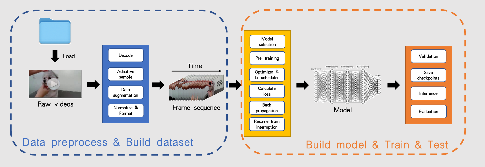
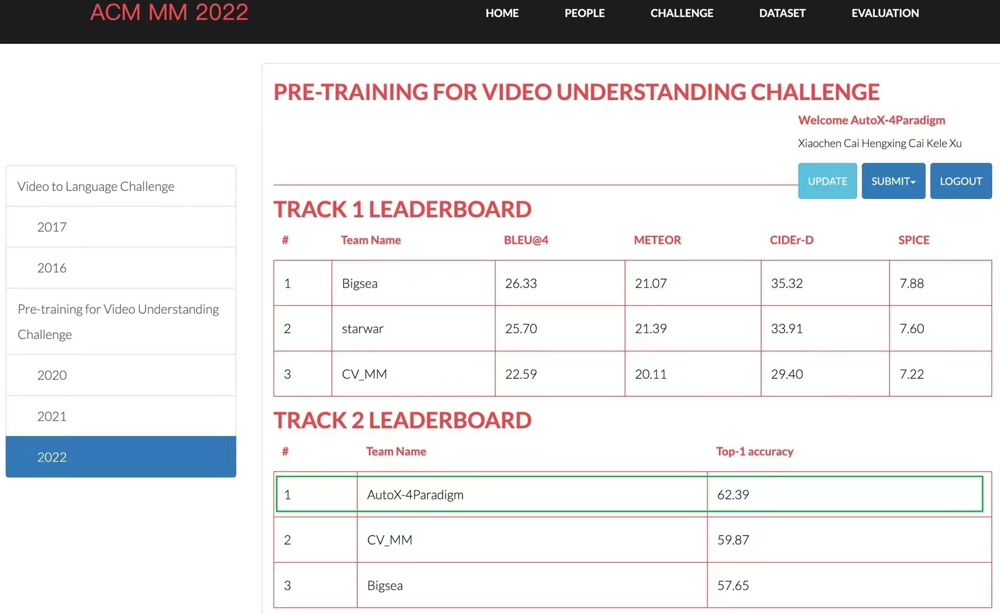

简体中文 | [English](./README_EN.md) 
## AutoX_video是什么
autox_video提供了一种基于mmaction2代码库的视频理解自动机器学习框架，您可以通过简单的命令便利地进行视频理解任务的训练。



## 目录
[安装](#安装)

[快速开始](#快速开始)

[预训练权重](#预训练权重)

[效果展示](#效果展示)

[后续工作](#后续工作)

## 

## 安装
#### 依赖包
1. Python 3.6+
2. PyTorch 1.3+
3. CUDA 9.2+ (If you build PyTorch from source, CUDA 9.0 is also compatible)
4. GCC 5+
5. mmcv 1.1.1+
6. Numpy
7. ffmpeg (4.2 is preferred)
8. decord (optional, 0.4.1+): Install CPU version by pip install decord==0.4.1 and install GPU version from source

### Pytorch
根据[官方文档](https://pytorch.org)进行 PyTorch 和 torchvision 的安装，如：
```
conda install pytorch torchvision -c pytorch
```
确保 CUDA 的编译版本和 CUDA 的运行版本相匹配。 用户可以参照[PyTorch 官网](https://pytorch.org)对预编译包所支持的 CUDA 版本进行核对。
### MMCV
安装 mmcv-full，我们推荐您安装以下预构建包：
```
# pip install mmcv-full -f https://download.openmmlab.com/mmcv/dist/{cu_version}/{torch_version}/index.html
pip install mmcv-full -f https://download.openmmlab.com/mmcv/dist/cu102/torch1.10.0/index.html
```
另外，用户也可以通过使用以下命令从源码进行编译：
```
git clone https://github.com/open-mmlab/mmcv.git
cd mmcv
MMCV_WITH_OPS=1 pip install -e .  # package mmcv-full, which contains cuda ops, will be installed after this step
# OR pip install -e .  # package mmcv, which contains no cuda ops, will be installed after this step
cd ..
```
或者直接运行脚本：
```
pip install mmcv-full
```
### 其他
```
pip install -r build.txt
python mmaction2/setup.py develop
```

## 快速开始
我们提供了一个demo数据集作为测试，您可以以同样的方式运行您自己的数据集。您可以通过如下指令快速开始。
### 训练
```
python AutoTrain.py
```
这会启动模型的训练，我们会自动保存模型的训练结果，并且在每两个epoch结束时在验证集上评估模型并储存最优权重。

当意外中断时，重新执行此命令，我们会将恢复之前的训练结果而不是重新开始（除非你修改了工作目录的位置）。

您可以通过修改[config.yaml](config.yaml)中的数据集设置来在自己的数据集上训练和测试模型。

执行下面的脚本，可以启动多卡并行训练，{NUM_GPUS}修改为本机gpu数量
```
./dist_train.sh {NUM_GPUS}
```
### 测试
```
python AutoTest.py
```
这会自动读取工作目录中储存的最优权重，并用在测试集上测试模型效果，
并将推理结果输出到[config.yaml](config.yaml)中指定的位置（默认为results.json）。

执行下面的脚本，可以启动多卡并行推理，{NUM_GPUS}修改为本机gpu数量
```
./dist_test.sh {NUM_GPUS}
```
### 使用高级api进行训练和推理
这里举例说明如何使用高级api
```
# ensure your current working directory is AutoX/autox/autox_video
import AutoXVideo
autox_video = AutoXVideo()

# ------------------
# Load cfg from file (recommend)

autox_video.read_cfg('config.yaml')
autox_video.fit()
autox_video.transform()

# ------------------
# Manually specify cfg

autox_video.fit(
    data_root='data/demo/videos',
    ann_file_train='data/demo/annotations/train_list.txt',
    ann_file_val='data/demo/annotations/val_list.txt',
    work_dir='work_dirs/demo',
    video_length=2,
    num_class=25,
    videos_per_gpu=8,
    epoch=50,
    evaluation=5
)
autox_video.transform(
    data_root='data/demo/videos',
    ann_file_test='data/demo/annotations/test_list.txt',
)
# ann_file_test is optional. if not specified, it will include all files in data_root.

# ------------------
# Transform only

autox_video.transform(
    data_root='data/demo/videos',
    ann_file_test='data/demo/annotations/test_list.txt',
    checkpoints='work_dirs/demo/latest.pth'
)

```

## 预训练权重
模型使用的预训练权重可以通过下面的链接下载，下载后将权重文件储存在checkpoints目录，训练时即会自动使用预训练的权重开始训练  
（预训练权重文件由[Video-Swin-Transformer](https://github.com/SwinTransformer/Video-Swin-Transformer)提供）

| Backbone |         Pretrain          | Lr Schd | spatial crop | acc@1 | acc@5 | #params | FLOPs  | model |
| :---: |:-------------------------:| :---: | :---: | :---: | :---: | :---: |:------:| :---: |
|  Swin-B  | ImageNet22k & Kinetics600 |  30ep   |     224      |  84.0  |  96.5  |   88M   | 281.6G | [github](https://github.com/SwinTransformer/storage/releases/download/v1.0.4/swin_base_patch244_window877_kinetics600_22k.pth)/[baidu](https://pan.baidu.com/s/1ZMeW6ylELTje-o3MiaZ-MQ) |


## 效果展示
我们取得了ACM MM 22 PRE-TRAINING FOR VIDEO UNDERSTANDING CHALLENGE比赛视频分类赛道的第一名


公开数据集上测试：

| Dataset    | Top 1 Accuracy |
|------------|---------|
| [HMDB51](https://serre-lab.clps.brown.edu/resource/hmdb-a-large-human-motion-database/) | 0.6357  |
| [UCF101](https://www.crcv.ucf.edu/research/data-sets/ucf101/) | 0.9407  |


## 后续工作
1. 目前代码仅支持Video Swin Transformer一种backbone，这是我们的实验中效果最好并且较为通用的模型，后续会增加更多的视频理解模型供用户自由选择
2. 目前仅支持视频分类，实际上本框架对于视频目标检测、视频语义分割等任务是通用的，后续会陆续开发应用于其他视频任务的接口
