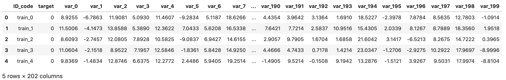
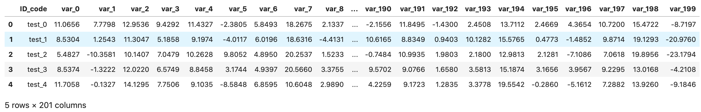
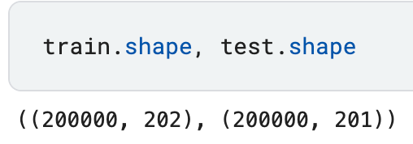
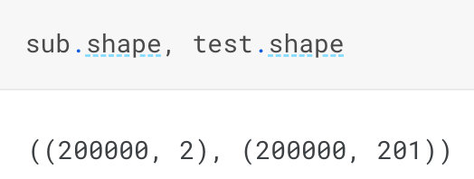
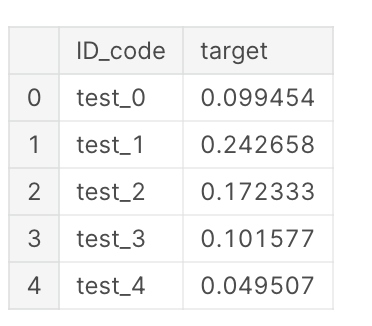
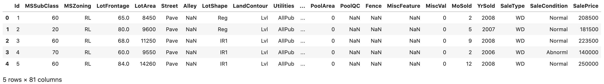
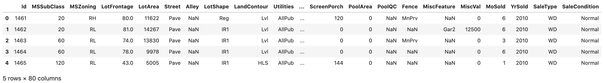
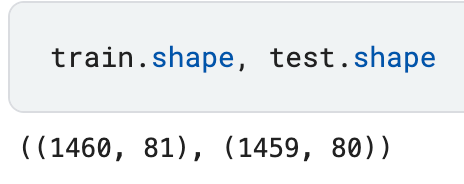
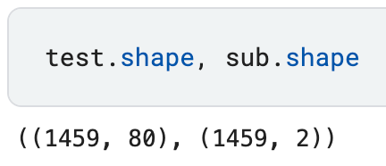
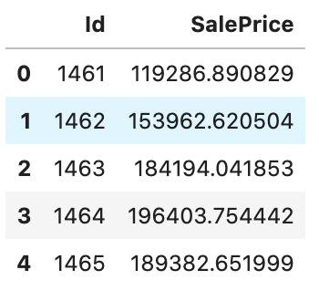

.. _quick-start-label:

Quick Start
===========

Install AutoX
---------------

As the compiled autox package is hosted on the Python Package Index (PyPI) you can easily install it with pip

.. code:: shell

   pip install automl-x -i https://www.pypi.org/simple/

or

.. code-block:: console

   $ git clone https://github.com/4paradigm/autox.git
   $ pip install ./autox

Before boring yourself by reading the docs in detail, you can dive right into AutoX with the following examples:

Binary classification example(Transaction Prediction)
-------

We are provided with an anonymized dataset containing numeric feature variables, the binary `target` column, and a string `ID_code` column.
The task is to predict the value of `target` column in the test set.

.. code:: python

   print(train.head())

.. code:: python

   print(test.head())

.. code:: python

   print(train.shape(), test.shape())

We build the automl pipeline with AutoX as following:

.. code:: python

    from autox import AutoX
    path = f'../input/santander-customer-transaction-prediction'
    autox = AutoX(target = 'target', train_name = 'train.csv', test_name = 'test.csv', id = ['ID_code'], path = path)
    sub = autox.get_submit()
    sub.to_csv("./autox_Santander.csv", index = False)

We get a pandas.DataFrame `sub` which has the same number of rows as test.

.. code:: python
   
   print(sub.shape(), test.shape())

.. code:: python

   print(sub.head())

You can execute this example with this link: `santander-autox  <https://www.kaggle.com/code/poteman/automl-for-santander-autox>`_.

Regression example(House Prices)
-------

With 79 explanatory variables describing (almost) every aspect of residential homes in Ames, Iowa, we need predict the `SalePrice` of each home.

.. code:: python

   print(train.head())

.. code:: python

   print(test.head())

.. code:: python

   print(train.shape(), test.shape())

We build the automl pipeline with AutoX as following:

.. code:: python

    from autox import AutoX
    path = '../input/house-prices-advanced-regression-techniques'
    autox = AutoX(target = 'SalePrice', train_name = 'train.csv', test_name = 'test.csv', id = ['Id'], path = path)
    sub = autox.get_submit()
    sub.to_csv("submission.csv", index = False)

We get a pandas.DataFrame `sub` which has the same number of rows as test.

.. code:: python

   print(sub.shape(), test.shape())

.. code:: python

   print(sub.head())

You can execute this example with this link: `house_price-autox <https://www.kaggle.com/code/poteman/kaggle-house-price-automl-autox>`_.
