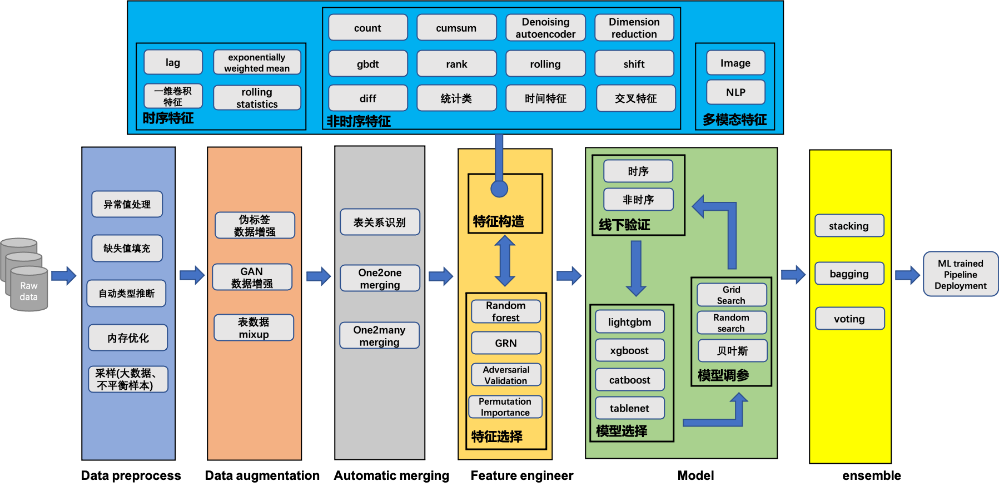

# 说明
我们希望AutoX成为国际领先的AutoML解决方案，为了打造性能优异、功能丰富、稳定性高、易用性高的自动机器学习产品，我们需要你的帮助!

所有的贡献方式，包括bug报告、bug修复、文档优化等都欢迎你们的参与，甚至简单的错别字修复也非常欢迎并感谢。

# 你将获得
- 技术能力的提升
- 积累自身的声望
- 人际关系拓展
- 提升个人综合素质, 包括沟通能力、解决问题的能力等

# 优秀的贡献者有机会获得
- 科研合作机会: 依托autox项目，和第四范式研究员以及高校顾问合作开展科研项目
- 第四范式正式员工/实习面试直通车

# AutoX主要提供的功能
- AutoML: 全流程端到端的自动机器学习的pipeline.
- 生产力工具: 快速实现机器学习中的某一个环节，如自动拼表、特征工程、特征选择、模型调参等.

# 当前技术方案

# 可贡献的内容

## 内容完善
- bug修复
- 功能优化: 对目前AutoX的代码中的效率、格式、注释等进行优化
- 中英文文档优化: 内容补充, 错别字修复等
- AutoX网页优化(sphinx编写)
- demo编写: 在新数据集上使用AutoX执行，获得结果. [参考](https://github.com/4paradigm/AutoX/blob/master/demo/stumbleupon/kaggle_stumbleupon_autox.ipynb)
- 效果对比: 在新数据集上使用autox执行，获得结果。并对比h2o和autogluon的效果. [参考](https://github.com/4paradigm/AutoX/tree/master/demo/stumbleupon)
- 测试代码

## 功能开发
### 功能性api贡献
#### 功能性api贡献说明: 
1. api的接口建议仿照sklearn的接口设计, 例如类需要实现一个fit和transform函数;
2. 给出该api的简要说明;
3. 在一个公开数据集上执行该功能的案例，给出案例公开链接.建议使用kaggle数据集以及kernel，并将kernel public.

#### 功能性api贡献参考示例:
- [gbdt特征代码](https://github.com/4paradigm/AutoX/blob/master/autox/autox_competition/feature_engineer/fe_gbdt.py)
- [gbdt特征案例](https://www.kaggle.com/code/poteman/ubiquant-gbdt-features/notebook?scriptVersionId=88706805)

#### 功能性api贡献可选方向: 
- 数据预处理方法
- 拼表技术或副表特征
- 特征工程
- 特征选择方法
- 自动调参方法
- 模型
- 融合技术
- metric设计

### automl pipeline贡献
#### automl pipeline贡献说明:
1. 给出端到端完整的pipeline代码;
2. 给出pipeline设计逻辑架构图;
3. 给出在不同数据场景下和autogluon和h2o的效果对比.

#### automl pipeline贡献参考示例:
[参考](https://github.com/4paradigm/AutoX/blob/master/autox/autox.py)

## 规划方向的开发
- 多分类任务
- 时空预测任务
- 多模态任务
- 分布式版本AutoX

## 社区运营
- issues解答
- 社区宣传
- 数据竞赛baseline编写

## 其他对AutoX有意义的内容
欢迎提议其他任意和AutoML相关的内容

# 贡献方式
建议通过pull request的方式提交修改，对git不熟悉的朋友可以参考这个[链接](https://gitbeijing.com/fork_flow.html)

# 联系方式
- AutoX贡献者意向成员群

- Email: caihengxing@4paradigm.com
